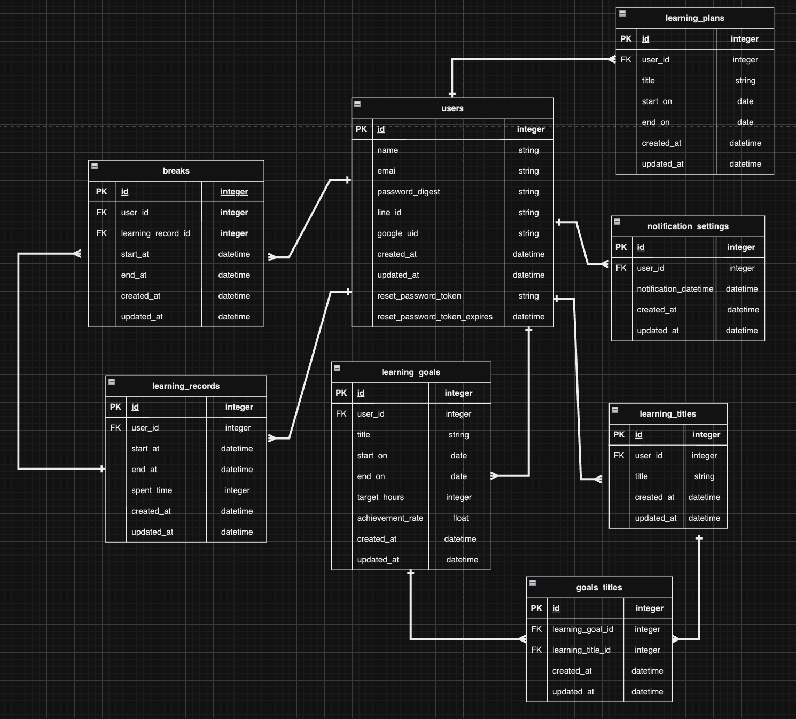

# gakusyu_app

# [学習ログ]

## サービス概要
学習ログはその名の通りあなたの学習を記録するサービスです。

## ユーザー層
シンプルな機能で自己学習をしたい社会人の方を対象にしたサイトにしたいと思っています。
学習をする上で共有機能はモチベーションにつながると思いますが、
時間を計測する、記録見る、計画するといったシンプルな機能のみを求めている人もいるのではないかと思います。
これによって目的の機能のみに集中することが出来ると思います。

## サービスコンセプト
サービスコンセプトは簡単に見やすく自分の努力を確認できるサービスです。
私は最近学習する際にはYouTubeの落ち着く音楽や夜の虫の鳴き声の動画などを流して
その再生時間で今日はどれくらい学習をしたのかを確認していました。
そんな中で学習時間を記録してどれくらいの時間、どれくらい平均で学習をしているのかを
簡単に見やすく確認できるサイトがあったら使いたい、そう言った理由からこのサービスを作りたいと思いました。

## サービスの差別化ポイント・推しポイント
サービスの差別化についてはデモ機能とシンプルなインターフェイスです。
- デモ機能について  

基本的にはユーザー登録をしてからでないと学習記録系のツールは利用できないのでサービスの実態が
分からなく登録にためらいが出ると思います。ですがデモ機能を実装する事でどういったサービスなのかを知ること
が出来、ためらいや不安感の解消に繋がると思います。

- シンプルなインターフェイスについて  

類似サイトや類似モバイルアプリをいくつか利用させてもらってみて学習を記録するまでの工程分かりずらいのと
学習を記録する以外でタイムライン、イベント、特集などの多くの機能がありますが全体の操作感として
少し複雑なのかなと感じました。また、実際の目的は自己学習をする事ですがそれ以外の項目がある事でユーザーの注意が逸れて
集中力が削がれる原因にもなると思います。なので自己学習の為の機能だけでシンプルに分かりやすく利用できる
サービスにしようと考えています。

## 実装を予定している機能

### MVP
- 会員登録
- ログイン/ログアウト
- 学習時間を記録するボタン(学習スタート、休憩、終了)
- 記録した学習時間表示する学習ログ(日、週、月単位の合計時間と平均時間など)
- 勉強計画機能(カレンダーでの学習予定日時の設定)
- プロフィール機能
- Googleログイン機能

### その後の機能
- LINE Messaging APIでの通知機能
- 勉強計画の機能(目標勉強時間)
- デモ機能(記録ボタンの機能、学習表の一時的な記録機能)

## 画面遷移図

https://www.figma.com/file/z9mHZYZq4XxtnaaEVjgf8F/Untitled?type=design&node-id=10%3A3&mode=design&t=2hRKX0wA3dI7XtOc-1

## ER図

